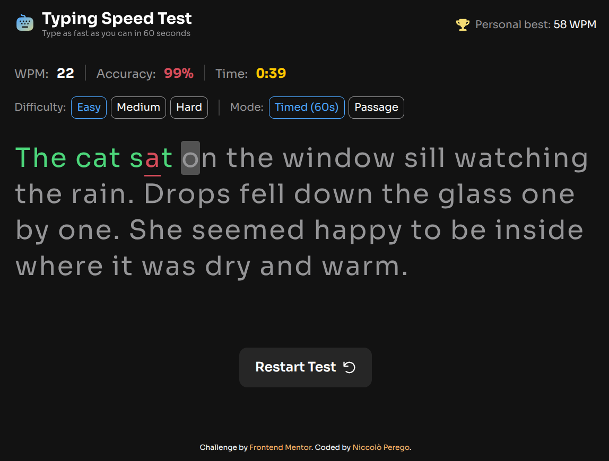

# Typing Speed Test - Frontend Mentor Challange - Angular

This is a solution to the [Typing Speed Test challenge on Frontend Mentor](https://www.frontendmentor.io/challenges/typing-speed-test-task-K0wHn8f4g). This application tests a user's typing speed and accuracy across different difficulty levels and modes.

## Table of Contents

- [Typing Speed Test - Frontend Mentor Challange - Angular](#typing-speed-test---frontend-mentor-challange---angular)
  - [Table of Contents](#table-of-contents)
  - [Overview](#overview)
    - [The Challenge](#the-challenge)
    - [Links (TODO)](#links-todo)
  - [My Process](#my-process)
    - [Built With](#built-with)
    - [Features](#features)
    - [What I Learned](#what-i-learned)
  - [Getting Started](#getting-started)
    - [Development server](#development-server)
    - [Building](#building)
    - [Tests](#tests)
  - [Author](#author)

## Overview

### The Challenge

Users should be able to:

- Start a test by clicking the start button or simply typing.
- Select a difficulty level (Easy, Medium, Hard).
- Switch between "Timed (60s)" mode and "Passage" mode (completion based).
- View real-time WPM (Words Per Minute), accuracy, and time stats.
- Receive visual feedback on correct/incorrect characters and cursor position.
- See a "High Score" celebration when beating a personal best (persisted via localStorage).
- View an optimal layout on different screen sizes.

### Links (TODO)

- Solution URL:
- Live Site URL:

## My Process

- **Technology Choice**: Selected Angular 21 to leverage the latest features. I was particularly interested in combining Signals for state management with RxJS Observables for handling the timer and input streams.
- **Analysis & Structure**: Analyzed the provided designs to break down the UI into reusable components. I started by scaffolding the basic HTML structure to establish the application's layout.
- **Logic Implementation**: Prioritized the core functionality—typing validation, WPM calculation, and game modes—before moving on to styling. This ensured a robust foundation for the application.
- **Styling & Polish**: Applied Tailwind CSS to match the design system, focusing on responsiveness and interactive states. Added animations for visual feedback during the typing test.
- **Testing & Refinement**: Performed manual and automated testing using Vitest to ensure data persistence worked correctly and to squash bugs related to the timer and text comparison logic.

### Built With

- **Angular** - Component-based framework
- **TypeScript** - Strongly typed logic
- **RxJS/Signals** - Handling timer streams and events
- **CSS/Tailwind** - Custom properties and responsive layout
- **Mobile-first workflow**

### Features

- **Dynamic Passage Loading**: Passages are fetched from a local JSON data source based on the selected difficulty.
- **Real-time Validation**: The typing engine compares input against the active passage in real-time, calculating accuracy on the fly.
- **Persistence**: Personal bests are stored in the browser's LocalStorage, so users retain their high scores across sessions.

### What I Learned

- Deepened my understanding of **Angular 21**'s reactivity model by combining Signals with RxJS interoperability.
- Gained hands-on experience configuring and writing unit tests using the **Vitest** framework.
- Explored CSS and DOM manipulation techniques to create the custom "confetti" celebration animation.

## Getting Started

This project was scaffolded with Angular CLI.

### Development server

Run `pnpm start` for a dev server. Navigate to `http://localhost:4200/`. The application will automatically reload if you change any of the source files.

### Building

Run `pnpm build` to build the project. The build artifacts will be stored in the `dist/` directory.

### Tests

Run `pnpm test` to see test results via Vitest. A coverage report will also be generated.

## Author

- Website - [growcoding.com](https://www.growcoding.com)
- Frontend Mentor - [@nicco88](https://www.frontendmentor.io/profile/nicco88)
- Linkedin - [linkedin.com/in/niccolo-perego](https://www.linkedin.com/in/niccolo-perego)
